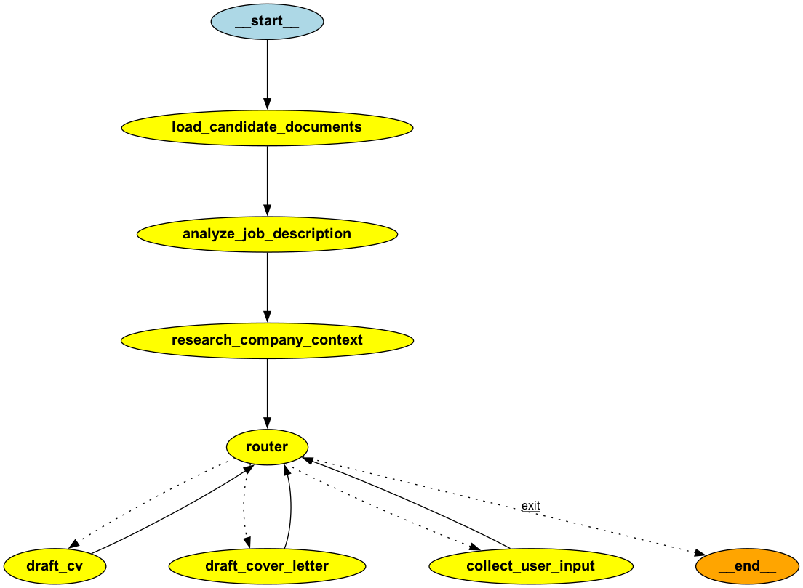

CV Editor Agentic System
========================

Create high‑quality, tailored CVs and cover letters with an AI-first, LangGraph‑based agentic workflow that reads your existing documents, analyzes a job description, researches the target company, and iteratively generates polished drafts with LLM-guided user feedback loops.

Table of Contents
-----------------

1. [Features](#features)  
2. [High-Level Architecture](#high-level-architecture)  
3. [Prerequisites](#prerequisites)  
4. [Project Setup](#project-setup)  
5. [Environment Variables](#environment-variables)  
6. [Running the Agent](#running-the-agent)  
7. [Workflow Walkthrough](#workflow-walkthrough)  
8. [Logging and Debugging](#logging-and-debugging)  
9. [Customization Tips](#customization-tips)  
10. [Troubleshooting](#troubleshooting)

Features
--------



- Reads existing CV/cover letter files (`CV/` folder, txt or pdf).
- Uses a LangChain LLM to extract structured job information from pasted descriptions.
- Calls Tavily search to gather company insights plus remote-work stance.
- Routes between CV generation, cover letter generation, or additional user input using an LLM-driven router.
- Saves generated artifacts to `generated_CVs/` and logs every step to both `logs/` and `debug/`.
- Supports iterative editing: user feedback is captured and fed back into the writing agents.
- Emphasizes human-in-the-loop control so you can steer the AI models at every decision point.

High-Level Architecture
-----------------------

- **LangGraph Orchestrator (`MasterAgent`)**: Builds the workflow graph, handles streaming execution, and coordinates interrupts for user input.
- **DocumentReaderAgent**: Loads user-provided documents from disk.
- **JobDescriptionAgent**: Pauses execution to request a job description, then extracts structured data.
- **SearchAgent**: Queries Tavily, summarizes results, and determines remote-work stance.
- **RouterAgent**: Uses conversation context to decide the next action (generate CV, cover letter, prompt user, exit).
- **CVWriterAgent / CoverLetterWriterAgent**: Generate tailored drafts using LangChain chat models.
- **UserInputAgent**: Collects free-form responses when more clarity or feedback is required.

All agents share a common `State` TypedDict managed by LangGraph, which keeps track of messages, extracted info, and generated artifacts. The result is a cohesive AI agentic system where multiple specialized models collaborate.

Prerequisites
-------------

- Python 3.11+ (project tested with 3.12).
- Access to OpenAI (for `openai:gpt-5-nano`) or whichever model you wire in via LangChain.
- Tavily API key for company research.
- macOS/Linux (Windows works but paths/logging instructions assume POSIX).

Project Setup
-------------

```bash
# clone the repo (example path)
git clone <repo-url> CV_editor
cd CV_editor

# create and activate a virtual environment (uv or venv)
uv venv               # or: python3 -m venv .venv
source .venv/bin/activate

# install dependencies
uv pip install -r requirements.txt   # or `uv pip sync pyproject.toml` if using uv/lockfile
```

Environment Variables
---------------------

Create a `.env` file in the project root (or set variables in your shell):

```
OPENAI_API_KEY=sk-...
TAVILY_API_KEY=tvly-...
```

`dotenv` loads these before any agent imports, so keep `.env` up to date.

Running the Agent
-----------------

```bash
source .venv/bin/activate
python langgraph_agent.py
```

The program will:

1. Load user CV/cover-letter data from `CV/`.
2. Ask you to paste the target job description.
3. Fetch company insights via Tavily.
4. Chat with you about what to generate next.
5. Produce tailored documents and save them to `generated_CVs/`.

While streaming, the CLI may pause with prompts such as “Please paste the job description…” or “Please provide your input:”. Paste multiline text and press `Ctrl+D` (or Enter twice) to continue.

Workflow Walkthrough
--------------------

1. **Document ingestion**: `DocumentReaderAgent` loads `CV/CV.(txt|pdf)` and `CV/cover_letter.(txt|pdf)` if available.
2. **Job description capture**: `JobDescriptionAgent` interrupts for pasted text, extracts company name, work type, requirements, etc.
3. **Company research**: `SearchAgent` builds a Tavily query, summarizes results with an LLM, and determines remote-work support.
4. **Routing decision**: `RouterAgent` considers chat history, existing outputs, and user feedback to pick the next node.
5. **Generation**:
   - `CVWriterAgent` creates or updates a CV using the selected LLM.
   - `CoverLetterWriterAgent` creates or updates a cover letter (often leveraging the freshly generated CV).
6. **User feedback loop**: If the router needs clarification, `UserInputAgent` interrupts the graph so you can provide instructions, which are then fed back into the next generation step.

Logging and Debugging
---------------------

- **Structured logs**: Stored in `logs/cv_editor_<timestamp>.log`.
- **Debug transcripts**: `debug/cv_editor_<timestamp>.log` captures prompts, state snapshots, and generated text segments for auditing.
- **Graph visualization**: On startup the orchestrator attempts to render `images/graph_visualization.png`. Install Graphviz + `pygraphviz` if you want this artifact.

Customization Tips
------------------

- **Models**: Change model IDs or temperatures in each agent (e.g., `CVWriterAgent` uses `temperature=0.7`). Ensure the chosen model is available in your OpenAI organization.
- **Prompt tone**: Update the system/human prompt strings in each agent to reflect a different writing style or formatting rules.
- **State fields**: Extend `State` in `langgraph_agent.py` if you want to track additional data between nodes.
- **Alternate search providers**: Replace `SearchAgent.search_tavily` with another API if Tavily isn’t desired. Just keep `company_info` schema consistent.

Troubleshooting
---------------

- **Missing docstring lint**: Already resolved; if you add new modules, remember to include docstrings for all public classes/functions.
- **Graphviz errors**: Install Graphviz (`brew install graphviz`) and `pygraphviz` per the instructions in `langgraph_agent.py`.
- **Tracing interrupts**: If the CLI seems stuck, make sure you finished input with `Ctrl+D` or typed `END` on its own line.
- **Imports failing in `langgraph_agent_example.py`**: This legacy sample references optional packages. Either install the missing dependencies or ignore the warnings; it is not used by the main workflow.

Questions or ideas? Open an issue or drop a note in the repo discussions. Happy document crafting!
